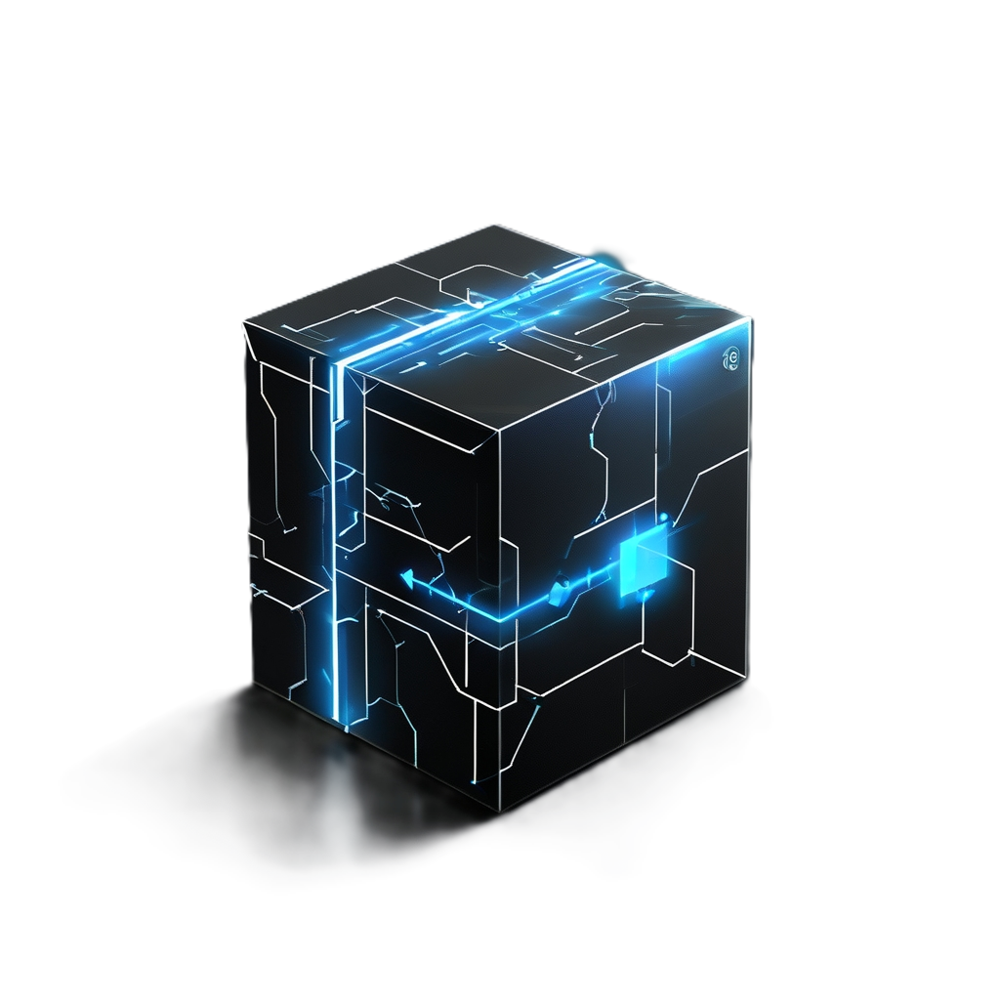

# BlackBox Blog

<div align="center">
  
  
  <div style="margin: 10px 0; display: flex; justify-content: center; gap: 10px;">
    <a href="README.md" style="padding: 8px 16px; border-radius: 4px; text-decoration: none; background-color: #f0f0f0; color: #333; display: flex; align-items: center;">
      <span style="margin-right: 5px;">🌐</span> 中文
    </a>
    <a href="https://github.com/hamster-yhz/blackBox_v2.0.0" target="_blank" style="display: flex; align-items: center;">
      
    </a>
  </div>
</div>

## 🚀 Project Overview

BlackBox is a modern personal blog system built with cutting-edge web technologies. This project is developed using [Cursor](https://cursor.sh/) IDE, a powerful AI-powered code editor that provides intelligent assistance during development. The project features:

- Built with Vue 3 + TypeScript + Vite
- Responsive design using Tailwind CSS
- Markdown article support
- Built-in code highlighting
- Article search functionality
- English/Chinese language switching

## 🌐 Language Switching

This project supports both English and Chinese languages. You can switch languages in the following ways:

1. Click the language toggle button in the top right corner
2. The system will automatically save your language preference
3. All page content will switch languages in real-time

## 🛠️ Tech Stack

- Frontend Framework: Vue 3
- Development Language: TypeScript
- Build Tool: Vite
- UI Framework: Tailwind CSS
- Routing: Vue Router
- Markdown Parser: marked
- Code Highlighting: highlight.js
- Search: fuse.js
- Icons: Font Awesome

## 📋 Key Features

1. **Modern Tech Stack**
   - Vue 3 Composition API
   - TypeScript type safety
   - Vite fast development experience
   - Tailwind CSS atomic styling

2. **Blog Features**
   - Markdown article support
   - Code highlighting
   - Article categories and tags
   - Full-text search
   - Responsive design

3. **Development Experience**
   - Hot Module Replacement (HMR)
   - TypeScript type checking
   - Automatic build and deployment
   - Code quality checks

## ⚠️ Copyright Notice

This project is an original work and all rights are reserved. Unauthorized copying, modification, or commercial use is prohibited. We are committed to maintaining the uniqueness and innovation of our project, and therefore discourage direct copying. If you're interested in our project, please contact us through:

- Email: email@655353.xyz
- GitHub: [yhz](https://github.com/hamster-yhz/)

## 📝 Usage Guide

1. Clone the project
```bash
git clone https://github.com/your-username/blackbox-blog.git
```

2. Install dependencies
```bash
cd blackbox-blog
npm install
```

3. Run in development mode
```bash
npm run dev
```

4. Build for production
```bash
npm run build
```

## 🤝 Contribution Guidelines

We welcome constructive suggestions and feedback, but please respect the originality of the project. If you wish to contribute code, please contact us first.

## 📄 License

This project is licensed under the [GNU Affero General Public License v3.0](LICENSE). This means:

- You are free to view and use the source code
- If you modify the code, you must make your changes public
- If you use the code for a web service, you must make your service code public
- Commercial use is prohibited
- Direct copying of this project is prohibited

## 🌐 Language Support

- English README (current file)
- [中文 README](README.md)

---

<div align="center">
  <p>© 2024 BlackBox Team. All rights reserved.</p>
</div> 